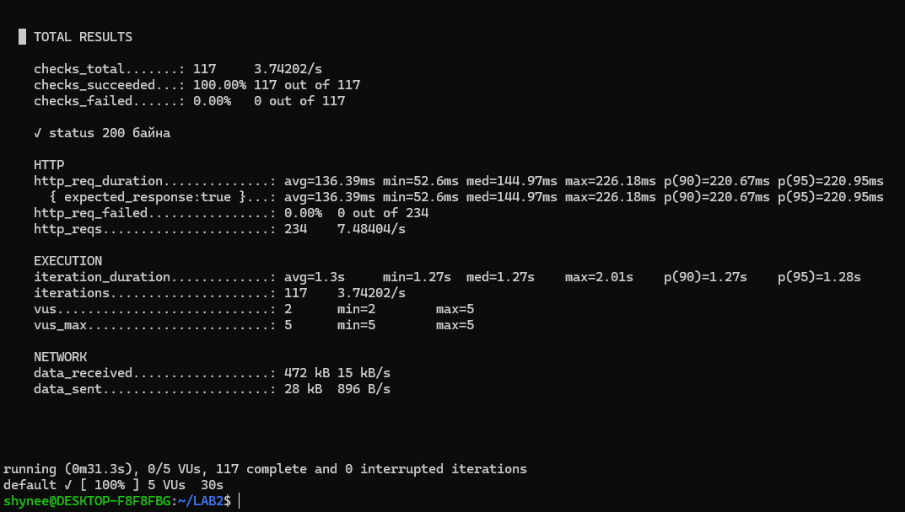
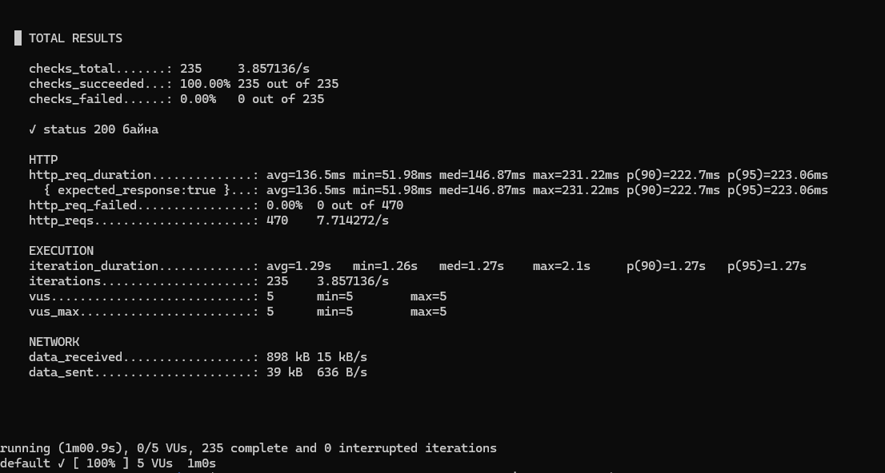
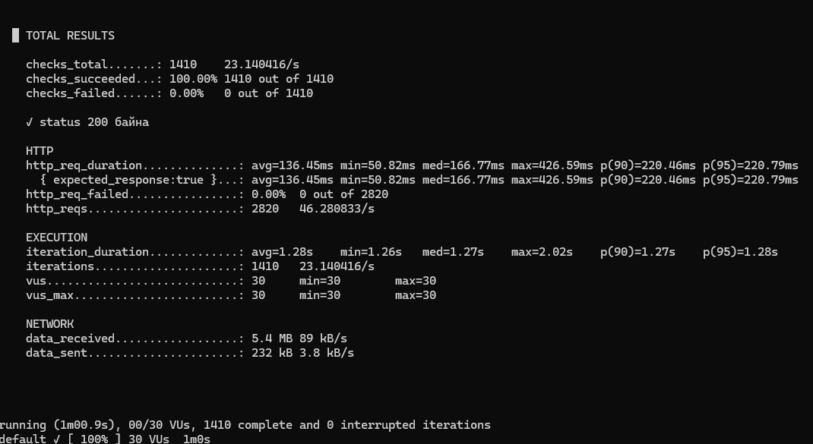
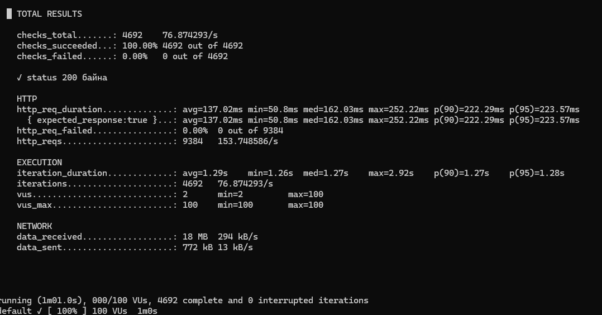
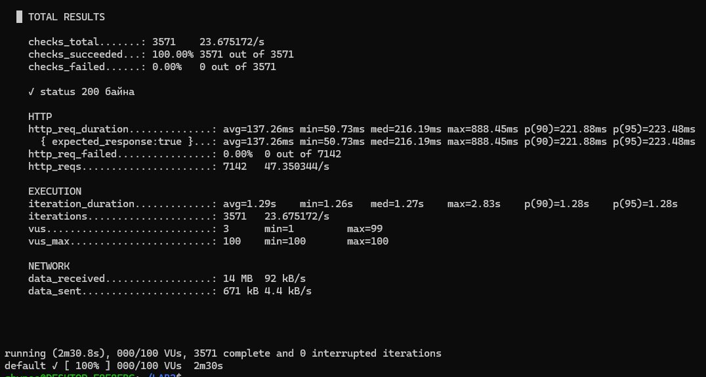
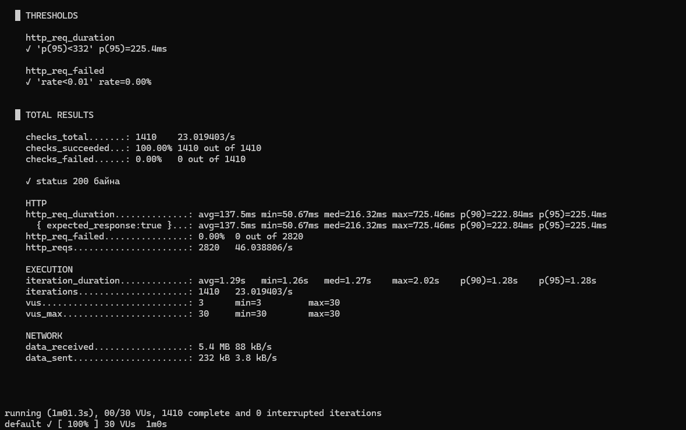
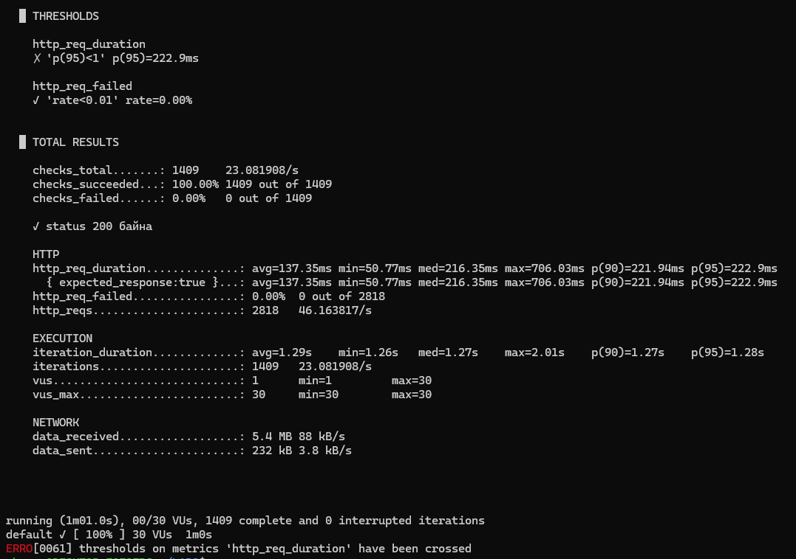

# Лабораторийн ажил №2 — k6 Performance Testing

**Хичээл:** F.CSA313 — Программ хангамжийн чанарын баталгаа ба тест
**Сэдэв:** Гүйцэтгэлийн хэмжүүрийг k6-аар хэмжих
**Оюутан:** О. Шинэбаяр
**Оюутны код:** B232270023

---

## 1. Лабораторийн ажлын зорилго

Энэхүү лабораторийн ажлын зорилго нь Grafana k6 хэрэгслийг ашиглан веб системийн гүйцэтгэлийг ачааллын өөр өөр түвшинд хэмжиж, үр дүнг харьцуулан шинжлэхэд оршино.

Туршилтаар дараах үндсэн гүйцэтгэлийн хэмжүүрүүдийг судлав.

* **Latency** — хүсэлтийн хариу ирэх хугацаа
* **p90** — нийт хүсэлтийн 90% нь уг хугацаанаас бага хугацаанд биелсэн үзүүлэлт
* **p95** — нийт хүсэлтийн 95% нь уг хугацаанаас бага хугацаанд биелсэн үзүүлэлт
* **Throughput** — секундэд боловсруулсан HTTP хүсэлтийн тоо
* **Error Rate** — алдаатай HTTP хүсэлтийн хувь
* **Virtual Users (VU)** — системд зэрэг хандаж буй виртуал хэрэглэгчдийн тоо

Туршилтыг зөвшөөрөгдсөн `https://test.k6.io` тестийн орчин дээр хийсэн.

---

## 2. Ашигласан орчин

* **Үйлдлийн систем:** Windows + WSL2 Ubuntu
* **Performance testing tool:** Grafana k6
* **Script language:** JavaScript
* **Version control:** Git
* **Repository:** GitHub
* **Test target:** `https://test.k6.io`

k6-ийн суусан хувилбарыг дараах командаар шалгасан:

```bash
k6 version
```

> Энд өөрийн `k6 version` командын гарсан хувилбарыг оруулна.

---

## 3. Төслийн бүтэц

```text
LAB2/
├── script.js
├── stages.js
├── threshold.js
├── README.md
│
├── results/
│   ├── run-baseline.txt
│   ├── run-05vu.txt
│   ├── run-30vu.txt
│   ├── run-100vu.txt
│   ├── stages.txt
│   ├── threshold-pass.txt
│   └── threshold-fail.txt
│
└── screenshots/
    ├── 01-k6-version.png
    ├── 02-baseline.png
    ├── 03-5vu.png
    ├── 04-30vu.png
    ├── 05-100vu.png
    ├── 06-stages.png
    ├── 07-threshold-pass.png
    └── 08-threshold-fail.png
```

---

## 4. Үндсэн k6 тест

Үндсэн тестийн скрипт нь `https://test.k6.io` хаяг руу HTTP GET хүсэлт илгээж, серверээс HTTP status code `200` ирж байгаа эсэхийг `check()` ашиглан шалгана.

```javascript
import http from 'k6/http';
import { sleep, check } from 'k6';

export const options = {
    vus: 5,
    duration: '30s',
};

export default function () {
    const res = http.get('https://test.k6.io');

    check(res, {
        'status 200 байна': (r) => r.status === 200,
    });

    sleep(1);
}
```

---

## 5. Baseline хэмжилт

Эхний baseline тестийг **5 VU, 30 секунд** тохиргоогоор ажиллуулсан.

```bash
k6 run script.js | tee results/run-baseline.txt
```

Baseline хэмжилтийн үр дүн:

| Үзүүлэлт         |        Үр дүн |
| ---------------- | ------------: |
| VU               |             5 |
| Duration         |     30 секунд |
| Average latency  |     136.39 ms |
| p90              |     220.67 ms |
| p95              |     220.95 ms |
| Throughput       | 7.48404 req/s |
| Error Rate       |         0.00% |
| HTTP requests    |           234 |
| Checks succeeded |       100.00% |

Baseline тестийн гол хэмжүүр болгон **p95 = 220.95 ms**-ийг ашигласан.



---

## 6. 5 / 30 / 100 VU ачааллын тест

Системийн гүйцэтгэл ачаалал нэмэгдэхэд хэрхэн өөрчлөгдөж байгааг тодорхойлохын тулд 5, 30, 100 VU ашиглан тус бүр 1 минутын турш тест хийсэн.

Ажиллуулсан командууд:

```bash
k6 run --vus 5 --duration 1m script.js | tee results/run-05vu.txt

k6 run --vus 30 --duration 1m script.js | tee results/run-30vu.txt

k6 run --vus 100 --duration 1m script.js | tee results/run-100vu.txt
```

### Хэмжилтийн үр дүн

|  VU | p90 (ms) | p95 (ms) | Throughput (req/s) | Error Rate |
| --: | -------: | -------: | -----------------: | ---------: |
|   5 |   222.70 |   223.06 |           7.714272 |      0.00% |
|  30 |   220.46 |   220.79 |          46.280833 |      0.00% |
| 100 |   222.29 |   223.57 |         153.748586 |      0.00% |

### 5 VU

5 виртуал хэрэглэгчтэй тестийн үед p95 latency **223.06 ms**, throughput **7.714272 req/s** байсан. Error rate 0.00% буюу HTTP хүсэлтийн алдаа гараагүй.



### 30 VU

30 виртуал хэрэглэгчтэй үед p95 latency **220.79 ms** байсан бөгөөд throughput **46.280833 req/s** болж нэмэгдсэн. Error rate мөн 0.00% байсан.



### 100 VU

100 виртуал хэрэглэгчтэй үед p95 latency **223.57 ms**, throughput **153.748586 req/s** болсон. Error rate 0.00% хэвээр байсан.



---

## 7. Stages ачааллын тест

Системийн ачааллыг нэг түвшинд тогтмол өгөхөөс гадна VU-ийн тоог үе шаттай нэмэгдүүлж, дараа нь бууруулах stages тест хийсэн.

Stages тохиргоо:

```javascript
export const options = {
    stages: [
        { duration: '30s', target: 5 },
        { duration: '1m', target: 30 },
        { duration: '30s', target: 100 },
        { duration: '30s', target: 0 },
    ],
};
```

Энэ туршилтаар ачааллыг 5 VU хүртэл нэмэгдүүлж, дараа нь 30 VU, 100 VU хүртэл өсгөж, эцэст нь 0 VU болгон бууруулсан.

Stages тестийн нийт үр дүнгээс:

| Үзүүлэлт         |          Үр дүн |
| ---------------- | --------------: |
| p90              |       221.88 ms |
| p95              |       223.48 ms |
| Average latency  |       137.26 ms |
| Maximum latency  |       888.45 ms |
| Throughput       | 47.350344 req/s |
| Error Rate       |           0.00% |
| HTTP Requests    |            7142 |
| Checks succeeded |         100.00% |

Stages тестийн турш p95 latency ойролцоогоор 223.48 ms байсан бөгөөд бүх HTTP хүсэлт амжилттай биелсэн. Ачааллын түвшин үе шаттай өссөн боловч нийт хэмжилтээр error rate 0.00% хэвээр хадгалагдсан.



---

## 8. SLO болон Threshold

Системийн гүйцэтгэлийг зөвхөн хэмжих бус тодорхой шаардлага хангаж байгаа эсэхийг автоматаар шалгахын тулд k6-ийн `thresholds` боломжийг ашигласан.

### SLO сонгосон үндэслэл

Baseline тестийн p95 latency:

```text
p95 = 220.95 ms
```

Baseline хэмжилтээс үндэслэн p95 latency-д 50%-ийн нөөц зөвшөөрч SLO-г тооцсон.

```text
220.95 × 1.5 = 331.425 ms
```

Үүнийг бүхэлчилж:

```text
p(95) < 332 ms
```

гэсэн SLO сонгосон.

Мөн HTTP хүсэлтийн алдааны түвшин 1%-иас бага байх шаардлагыг:

```text
rate < 0.01
```

гэж тодорхойлсон.

Threshold тохиргоо:

```javascript
thresholds: {
    http_req_duration: ['p(95)<332'],
    http_req_failed: ['rate<0.01'],
},
```

---

## 9. Threshold PASS тест

SLO шаардлагыг шалгахын тулд 30 VU, 1 минутын тест ажиллуулсан.

PASS тестийн үр дүн:

| Threshold       | Бодит үр дүн | Төлөв |
| --------------- | -----------: | :---: |
| p95 < 332 ms    |    225.40 ms |  PASS |
| Error rate < 1% |        0.00% |  PASS |

Тестийн p95 latency **225.40 ms** байсан тул тогтоосон **332 ms** босгоос бага байна. Мөн HTTP error rate **0.00%** байсан тул 1%-иас бага байх шаардлагыг хангасан. Иймээс SLO-ийн хоёр threshold хоёулаа амжилттай биелсэн.



---

## 10. Threshold FAIL тест

Threshold хэрхэн алдаа илрүүлж байгааг шалгахын тулд latency-ийн босгыг зориудаар маш хатуу буюу:

```text
p(95) < 1 ms
```

болгон өөрчилж тест хийсэн.

FAIL тестийн үр дүн:

| Threshold       | Бодит үр дүн | Төлөв |
| --------------- | -----------: | :---: |
| p95 < 1 ms      |    222.90 ms |  FAIL |
| Error rate < 1% |        0.00% |  PASS |

Бодит p95 latency **222.90 ms** байсан бөгөөд 1 ms-ийн зориудаар хатуу босгыг хангах боломжгүй байсан учир `http_req_duration` threshold FAIL болсон. Харин HTTP error rate **0.00%** байсан тул error rate-ийн threshold PASS болсон.

Энэхүү туршилт нь k6 threshold ашиглан гүйцэтгэлийн шаардлага зөрчигдсөн эсэхийг автоматаар тодорхойлж болохыг харуулсан.



---

## 11. Үр дүнгийн харьцуулалт

5 VU-ээс 30 VU болгон ачааллыг нэмэгдүүлэхэд throughput **7.714272 req/s-ээс 46.280833 req/s** болж ойролцоогоор 6 дахин өссөн.

30 VU-ээс 100 VU болгоход throughput дахин нэмэгдэж **153.748586 req/s** болсон.

Харин p95 latency нь 5 VU үед 223.06 ms, 30 VU үед 220.79 ms, 100 VU үед 223.57 ms байсан. Өөрөөр хэлбэл хэрэглэгчийн тоо 20 дахин нэмэгдсэн ч p95 latency энэ туршилтын хүрээнд огцом өсөөгүй.

Мөн 5, 30, 100 VU-ийн бүх хэмжилтийн error rate **0.00%** байсан.

Иймээс туршсан 100 VU хүртэлх ачааллын хүрээнд throughput өсөхийн зэрэгцээ p95 latency ойролцоо түвшинд хадгалагдсан бөгөөд HTTP алдаа ажиглагдаагүй.

---

## 12. Дүгнэлт

Энэхүү лабораторийн ажлаар Grafana k6 ашиглан веб системийн гүйцэтгэлийг өөр өөр ачааллын түвшинд хэмжиж туршлаа. Эхний baseline тестээр 5 VU үед p95 latency 220.95 ms байсан бөгөөд үүнийг дараагийн SLO тодорхойлох суурь хэмжилт болгон ашигласан. 5, 30, 100 VU-ийн харьцуулсан туршилтаар виртуал хэрэглэгчийн тоо нэмэгдэх тусам throughput 7.714272 req/s-ээс 153.748586 req/s хүртэл мэдэгдэхүйц өссөн. Харин p95 latency 220–224 ms орчимд хадгалагдаж, туршсан ачааллын хүрээнд хэрэглэгчийн хүлээх хугацаанд огцом доройтол ажиглагдаагүй. Мөн бүх 5, 30, 100 VU тестийн HTTP error rate 0.00% байсан нь хүсэлтүүд амжилттай боловсруулагдсаныг харуулсан. Stages тестээр ачааллыг үе шаттайгаар 100 VU хүртэл нэмэгдүүлэхэд нийт p95 223.48 ms, error rate 0.00% гарсан. Baseline p95 хэмжилтийг 1.5 дахин өсгөж p95 < 332 ms гэсэн SLO тогтоосон бөгөөд 30 VU-ийн PASS тестийн p95 225.40 ms гарснаар уг шаардлага хангагдсан. Threshold-ийн ажиллагааг баталгаажуулах зорилгоор p95 < 1 ms гэсэн зориудаар хатуу босго тавихад бодит p95 222.90 ms байсан учир latency threshold FAIL болсон. Энэ нь latency, throughput, error rate зэрэг хэмжүүрийг зөвхөн тус тусад нь харахаас гадна ачааллын түвшинтэй хамтатган шинжлэх шаардлагатайг харууллаа. Мөн k6-ийн threshold болон SLO ашигласнаар системийн гүйцэтгэлийн шаардлагыг тоон хэмжүүрээр тодорхойлж, тестийн үр дүнгээр автоматаар PASS эсвэл FAIL байдлаар үнэлэх боломжтойг практик туршилтаар бататгалаа.

---

## 13. Үр дүнгийн файлууд

Туршилтын terminal output-уудыг бүрэн эхээр нь `results/` хавтсанд хадгалсан.

```text
results/run-baseline.txt
results/run-05vu.txt
results/run-30vu.txt
results/run-100vu.txt
results/stages.txt
results/threshold-pass.txt
results/threshold-fail.txt
```

Эдгээр файлууд нь README доторх хүснэгт болон дүгнэлтэд ашигласан хэмжилтийн бодит үр дүнг агуулна.

---

## 14. Туршилтын screenshot-ууд

Туршилт бүрийн k6 summary хэсгийн screenshot-уудыг `screenshots/` хавтсанд хадгалсан.

```text
screenshots/01-k6-version.png
screenshots/02-baseline.png
screenshots/03-5vu.png
screenshots/04-30vu.png
screenshots/05-100vu.png
screenshots/06-stages.png
screenshots/07-threshold-pass.png
screenshots/08-threshold-fail.png
```

---

## 15. Ажиллуулах заавар

Baseline тест:

```bash
k6 run script.js
```

5 VU:

```bash
k6 run --vus 5 --duration 1m script.js
```

30 VU:

```bash
k6 run --vus 30 --duration 1m script.js
```

100 VU:

```bash
k6 run --vus 100 --duration 1m script.js
```

Stages тест:

```bash
k6 run stages.js
```

Threshold тест:

```bash
k6 run threshold.js
```

---

## 16. Ерөнхий үр дүн

Туршилтын үр дүнд `https://test.k6.io` систем нь туршсан 5–100 VU ачааллын хүрээнд HTTP хүсэлтүүдийг алдаагүй боловсруулсан. Throughput ачаалалтай хамт өссөн бөгөөд p95 latency харьцангуй тогтвортой байсан. Baseline хэмжилтэд үндэслэн тодорхойлсон **p95 < 332 ms**, **error rate < 1%** SLO нь PASS туршилтаар хангагдсан.
